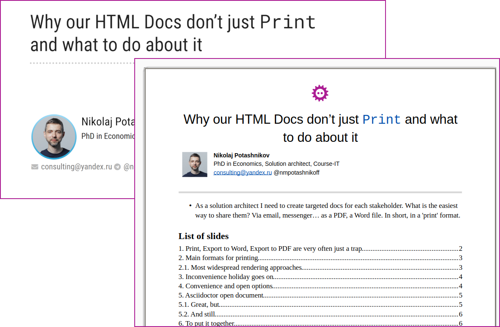
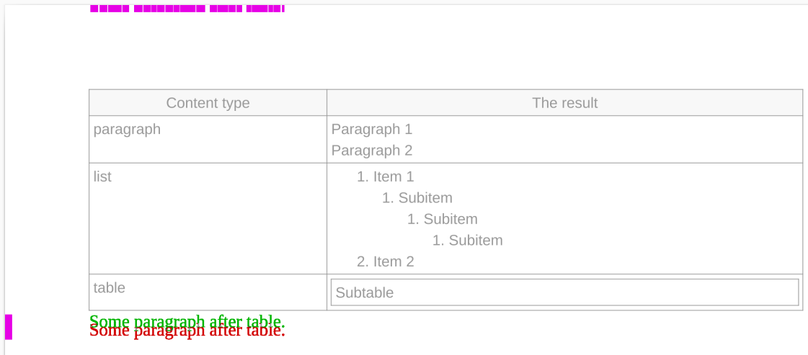

= Why our HTML Docs Don't Just `Print` and What to Do About It
:!imagesdir:
:source-highlighter: rouge
:revealjsdir: reveal.js
:revealjs_customtheme: white-course.css
:revealjs_slideNumber:
:revealjs_history:
:revealjs_progress:
:revealjs_mouseWheel: true
:revealjs_center: false
:revealjs_transition: none
:revealjs_width: 1600
:revealjs_height: 900
:icons: font
:figure-caption!:
:example-caption!:
:table-caption!:

[.title-footer]
[cols="260,1100,320"]
// tag::asciidoc-title-table[]
|===
a|
[.title-photo]
image::images/nmp1.jpg[]
a|
[.full-name]
Nikolaj Potashnikov

[.bio]
PhD in Economics, Solution architect, Course-IT
.2+>.>a|{nbsp}
[.logo]
image::images/fosdem-logo.svg[]
2+a|
[.contact]
icon:envelope[] consulting@yandex.ru icon:telegram[]{nbsp}@nmpotashnikoff
|===
// end::asciidoc-title-table[]

[.notes]
--
* As a solution architect, I need to create targeted docs for each stakeholder.
What is the easiest way to share them?
Via email, a messenger... as a PDF, a Word file.
In short, in a print format
* [REF] Why this epigraph?
** It’s FOSDEM, and Liszt was one of the most free spirited composers — and perhaps people
** Value is in the result; tools shouldn’t limit freedom in getting the result we need to get
** A conductor should get the maximum out of the capabilities he has in the orchestra, so should we, no matter what constraints we've got on the side of input markup, output format, rendering technology
--

[[a400]]
[%notitle]
== Epigraph

"The principal task of a conductor is not to{nbsp}put himself in{nbsp}evidence but to{nbsp}disappear behind his{nbsp}functions"
-- Liszt Ferenc

[[a1]]
== `Print`, `Export to Word`, `Export to PDF` are very often just a trap

[%step]
.What to do with a long line in a listing?
* We may scale
* Or use landscape orientation
* Or both, but would it be enough?
* If not, we may fire error for long lines or wrap them
* With linefeed and spaces?
And how to copy?
* With indents?
Still impossible to copy from PDF
* And on the web we can just add horizontal scroll bar.

[%step]
WARNING: There is a core mismatch: semantic markup meets the rigid world of print

[.notes]
--
* Take a simple listing... (go through very briefly just to give filling)
** Stop on orientation -- it is already not about semantic markup. Landscape for listing, for section, for higher level section?
Should tech writer use media hints?
* The goal of this talk is to show an approach to tackling such problems
* This talk is aimed at engineers who automate documentation and need reliable print output
--

[[a300]]
== Iterations in converting simple text markup to print formats

* https://github.com/CourseOrchestra/course-doc: XSL-FO templates for Asciidoctor -> DocBook backend
* https://github.com/CourseOrchestra/asciidoctor-open-document: Open Document Converter for Asciidoc
* https://github.com/fiddlededee/unidoc-publisher: UniDoc Publisher -- any markup to any printing rendering engine

[.notes]
--
* Today we are speaking about UniDoc Publisher approach, but we'll look at Asciidoctor Open Document. Why, despite success an extra step was needed
--

[[a17]]
== Main formats for printing

[%step]
. PDF
. Text processing formats (Open XML -- MS Office, Open Document -- LibreOffice)
. HTML?

[%step]
[TIP]
CSS Paged Media -- CSS extension, defining style specific for printing

[.notes]
--
* Despite we live with Paged Media CSS for almost 15 years, HTML -- still poor browser support, usually used via PDF. HTML for printing is an intermediary format. There are great open-source solutions to convert it to PDF -- WeasyPrint and a number of a great non-open-source solutions. But still HTML is an intermediary format
* [REF] If somebody is interested, probably the most well-known are Antenna Publisher, Oxygen
--

[[a2]]
=== Most widespread rendering approaches

[%step]
* PDF <- native PDF-generating libraries
* PDF <- XSL-FO with FOP-processors
* PDF <- via TeX
* PDF <- HTML + Paged Media CSS
* DOCX/ODT, PDF <- +/- text processors (MS Word, LO Writer)

[%step]
[WARNING]
====
These technologies are not aligned in a great number of details like:

* Apache FOP has problems with Leader alignment (dots in a table of contents)
* LO Writer doesn't support typography (like keep with next) within table cells
* Microsoft doesn't recommend running automation tasks (like saving PDF) on a server
====

[.notes]
--
* There are others, but these cover most cases
* [REF] Native libraries examples: ReportLab in Python, Prawn in Ruby, PDFBox in Java
* [REF] You can see Leader Problems in UniDoc Publisher documentation
* [REF] https://support.microsoft.com/en-us/topic/considerations-for-server-side-automation-of-office-48bcfe93-8a89-47f1-0bce-017433ad79e2
--

== Some brief conclusions

[%step]
[WARNING]
====
Feel like speleologist?
====

[%step]
--
[%step]
* The world of printing is the world of constraints
* And those constraints differ for each technology, you often need to support several chains (exquisitely looking PDF with TeX and LibreOffice for coordination)
* With no universal solutions
--

[.notes]
--
Two speleologists meet in a narrow tunnel.
I'm from a dead end.
I'm too!

* Documentation of UniDoc Publisher is created with Asciidoctor and published with WeasyPrint, XSL-FO and Open Document toolchains. Looks pretty the same. But just as a proof of concept
--

[[a50]]
== UniDoc Publisher approach suits best if at least `one of`

* You don't prepare documentation especially for printing purposes
* You are automating documentation generation and hope it will look good, no matter what will be generated
* Your output format is one of the text processing format

[.notes]
--
* First point is usually true if inputs -- Simple markup/Wiki, main means of publication -- HTML or static site
--

[[a9]]
== In search for flexibility: Asciidoctor open document

.Automation on the writer side
--
[%step]
. Asciidoctor parses markup into AST (Abstract Syntax Tree)
. You may transform AST with Asciidoctor tree processor
. Asciidoctor runs writer template for each AST node recursively
. You may override writer with pure Ruby or with special Slim templates
--

[.notes]
--
* First idea was to follow Asciidoctor ways, and these proved to be working ways
* [REF] Asciidoctor tree processor doesn't allow to work with inline contents
--

[[a301]]
=== A simplified processing AST example

[cols="2,3"]
|===
a|
[source, yaml, indent=0]
----
      - !<OrderedList>
        roles:
        - "arabic"
        id: "ol-1"
        captioned_title:
            children:
            - !<Text>
              text: "Automation"
        children:
        - !<ListItem>
          children:
          - !<Paragraph>
            children:
            - !<Text>
              text: "Asciidoctor..."
        - !<ListItem>
      ...
----

a|
[source,slim]
----
- list_style = "#{get_basic_style} ordered-list"
- if captioned_title?
  text:p text:style-name="#{list_style}"
    text:bookmark text:name="#{id}"
    =captioned_title

text:list text:style-name="#{list_style}"
  - items.each_with_index do \|item, index\|
  ...
----
|===

[.notes]
--
* dash means code in Ruby
* `get_basic_style` is some external Ruby helper function
--

[[a10]]
=== Great, but

[%step]
* You can't override part of a template
* You should invent something for styling

[%step.light-indent-before]
.Styling? But text processors do support styling!
--
[WARNING]
====
[%step]
* `bold, green` -- impossible to apply two styles to one element
====
--

[%step]
[TIP]
====
* Asciidoctor Open Document uses slightly extended intermediary OD format (to preserve AST attributes)
* It uses special functions that check, if style should be applied. It doesn't know styling attributes but forces the Open Document style structure
====

[.notes]
--
* In text processors we can't apply two styles, so we can't leave styling to text processor template
* This extended format resembles AST itself
--

[[a11]]
=== And still

[%step]
* Unexpectedly transforming this extended Open Document format became one of the most used features of Asciidoctor Open Document
* Styling as separate task of writing proved also to be useful
* Gradle was magnificent in gluing all parts together

[.notes]
--
* But obviously we should transform AST directly, not it's XML representation. Pandoc clearly showed that transforming AST is very convenient. It turned out to be much more useful than expected, especially if we are dealing with print output without CSS
* It is important not to output raw templates, but override only styling part
* Although Asciidoctor Open Document is glued with Docker, experiments showed, that gluing with Gradle is much more controllable. Yes, finally it would be docker, but at the very end

TIP: At this point, it became clear that the approach could be improved at an architectural level
--

[[a12]]
== Thoughts before the second step

[%step]
* If creating universal converter is impossible...
* We should create *meta converter* -- platform for building converters

[%step.indent-before]
.Estimated requirements
--
[%step]
* Native converter as a reader
* Sound ways of transforming AST
* A good approach for styling as a separate focus
* 99% generic writer
* Good integration with CI/CD with a focus on homogeneity
--

[.notes]
--
Close to Pandoc but with a focus on native converter, style overriding and CI/CD homogeneity
--

[[a200]]
=== Native converter as a reader?

[%step]
TIP: Each converter outputs HTML.
HTML is quite semantic, why shouldn't we use it?

[[a105]]
== Let's convert this presentation to LO Writer

[.notes]
--
This presentation is created with Asciidoctor Reveal.js, so we can convert it to document with notes
--

[[a306]]
=== Notes on this demo

[%step]
* All conversion settings are written in Kotlin
* Everything is in a single Gradle script (`build.gradle.kts`)
* The following code listings are excerpts from this script

[.notes]
--
* Instead of Gradle script it can be just an ordinary Java/Kotlin project, with a CLI or a web service utility as an output
--

[[a106]]
=== Boilerplate

[source,kotlin,indent=0]
----
include::build.gradle.kts[tag=boiler-plate]
                // Processing AST
include::build.gradle.kts[tag=boiler-plate-2]
----

[.notes]
--
* Asciidoctor is a part of a Gradle build
* The project starts not from Asciidoctor HTML, but from Reveal.js Asciidoctor HTML to make notes contents closer to slides and as a proof of concept. The technology has a safety margin against any HTML: Asciidoc HTML, Asciidoc Reveal.js HTML, MD, Wiki, ReST...
* The boilerplate is quite minimalistic
--

[[a107]]
=== Processing AST

[source,kotlin,indent=0]
----
include::build.gradle.kts[tag=orchestration-rebuild-title]
----

[.notes]
--
Typical AST transforming code. Typed, navigable, and testable

Here we find section with level 1 heading (title slide), then insert before it the transformed version, and finally remove the old version
--

[[a108]]
=== Rearranging title (Asciidoc source)

[source,asciidoc]
----
include::fosdem-printing.adoc[tag=asciidoc-title-table]
----

[.notes]
--
All elements have roles
--

[[a109]]
=== Rearranging title, extracting semantics

[source,kotlin,indent=0]
----
include::build.gradle.kts[tag=extracting-title-element]
----

[.notes]
--
Looks like XPath but once again typed, navigable, and testable
--

[[a110]]
=== Rearranging title, constructing title

[source,kotlin,indent=0]
----
include::build.gradle.kts[tag=building-new-title]
----

[.notes]
--
Rearranging looks like Slim (or XSLT) templates. Not so slim as Slim, but definitely slimmer than XSLT
--

[[a309]]
=== Back return to the result

[.notes]
--
An epigraph appeared from the second slide. You may look at `build.gradle.kts` and find out how. But it is a very common task when we render printing version of a document
--

[[a201]]
=== Styling

[source,kotlin,indent=0]
----
include::build.gradle.kts[tag=title-page-styles]
----

[.notes]
--
Programmable, but overrides only styling. As mentioned before UniDoc Publisher doesn't know about styling attributes, but it ensures the structure of a style
--

[[a112]]
=== Some more AST processing

[source,kotlin,indent=0]
----
include::build.gradle.kts[tag=orchestration-other]
----

[.notes]
--
<1> Inserting horizontal lines before notes
<2> Preventing slide from breaking
<3> Applying custom style and rouge code highlighting styles

* Rouge styles are generated automatically from rouge.css. The code is in `build.gradle.kts` -- just about 20 lines. Using CSS for each rendering technology is really useful in many cases
* Styling approach to prevent each slide from breaking is the same
--

[[a113]]
=== Extending AST

[%step]
[source,kotlin,indent=0]
----
include::build.gradle.kts[tag=defining-custom-element]
----

[%step]
[source,kotlin,indent=0]
----
include::build.gradle.kts[tag=custom-element]
----

[.notes]
--
* Extending AST is quite simple. But it is rarely used. This is artificial example, easier solution would be to add paragraph directly
* The same approach lets us completely override template, but once again it is rarely used. Only if some bug in UniDoc publisher writer is found, but we don't want to wait for a fix
--

[[a14]]
=== Testing

[.notes]
--
If we have Asciidoctor with some Printing converter platform on top and Converter on top, we should be sure, that minor changes won't break anything

I use the system of snippets, render them into PNG and compare by pixels with reference.
Almost 100% guarantee.

By the way, these snippets can be put into documentation. These are real cases of usage.
--

== Focus and trade-offs

[%step]
* CI friendly -- pure Gradle (or an ordinary Kotlin project) to rule them all
* No declarations, everything should be programmed
* Typed AST -- check before run
* Clean and testable code
* One AST and one styling approach, but different styling API for each backend

[.notes]
--
Once again about focus and trade-offs, but after the demo

[REF] Styling implementation for other formats can be looked at in the UniDoc Publisher documentation sources

* Gradle + Kotlin stack is just a coincidence, where syntax, wide ecosystem and CI accidentally met
* Still more coincidence -- they met Asciidoctor
* Still more coincidence -- they met LibreOffice API
* Too much coincidence for coincidence?
--

== Conclusion

[%step]
* Treat printing as engineering: design it, test it, automate it
* Printing is a lossy transformation — some semantics cannot survive it
* Keep rendering logic programmable and under your control

== Questions?

* https://github.com/fiddlededee/unidoc-publisher: UniDoc Publisher -- any markup to any printing rendering engine
* https://github.com/fiddlededee/fosdem-printing/tree/main: this presentation repository

