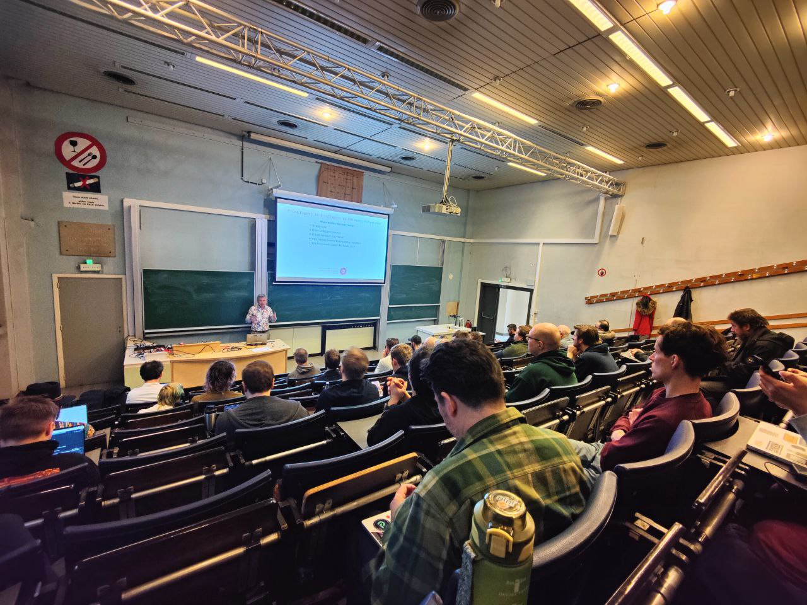

== Why our HTML Docs don't just `Print` and what to do about{nbsp}it
:gh-pages-url: https://fiddlededee.github.io/fosdem-printing
include::version.adoc[]

"The principal task of a conductor is not to{nbsp}put himself in evidence but to disappear behind his{nbsp}functions"
-- Liszt Ferenc

.FOSDEM'2026 talk materials (v{version})
* https://fosdem.org/2026/schedule/event/SVNUX9-print-doc-as-code[Video of the talk]
* https://github.com/fiddlededee/fosdem-printing[The source repository for these materials]
* https://github.com/fiddlededee/unidoc-publisher[UniDoc Publisher repository]
* {gh-pages-url}/fosdem-printing-v{version}.html[Presentation in HTML]
* {gh-pages-url}/fosdem-printing-animation-v{version}.pdf[Presentation in PDF with animation]
* {gh-pages-url}/fosdem-printing-no-animation-v{version}.pdf[Presentation in PDF with no animation]
* Notes for the presentation: {gh-pages-url}/fosdem-printing-notes-v{version}.pdf[PDF], {gh-pages-url}/fosdem-printing-notes-v1.0.1.docx[DOCX], {gh-pages-url}/fosdem-printing-notes-v1.0.1.odt[ODT], {gh-pages-url}/fosdem-printing-notes-v1.0.1.fodt[FODT]

====
A huge *thank you* to Ivan Ponomarev for diving into my talk and delivering it at FOSDEM so flawlessly, surely better than I would have. And thank you to the FOSDEM organizers for making it possible!
====

NOTE: During this talk Ivan added clarifying demo of the AS-IS conversion. In this version it was added as a separate slide

.Available Gradle tasks
include::tasks.adoc[]

